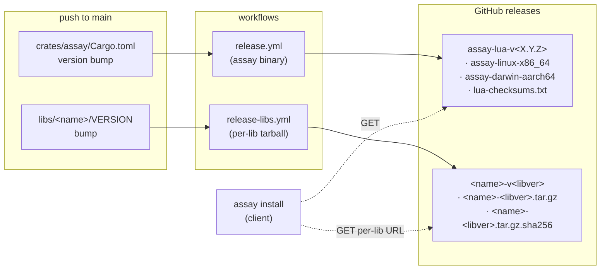

# 21 · `libs/` workspace folder + `assay install` subcommand

**Status:** spec **Date:** 2026-05-03

## Goal

Add a `libs/` directory at the assay workspace root for non-embedded Lua libraries that ship with
the platform but aren't baked into the runtime binary. Bring `sysops` in as the first lib. Add an
`assay install` subcommand that reads a `Manifest.lua`, fetches the declared binaries + libs,
validates checksums, and populates standard filesystem paths.

This supersedes the standalone `developerinlondon/assay-sysops` repo (archived as part of this
plan).

## Concept — three classes of platform code

| Class          | Where                           | Shipping mechanism                                            |
| -------------- | ------------------------------- | ------------------------------------------------------------- |
| **stdlib**     | `crates/assay/stdlib/`          | Embedded in `assay` binary at compile time                    |
| **libs**       | `libs/<name>/`                  | Tarball alongside the binary; loaded via `LUA_PATH`           |
| **extensions** | `crates/<name>/` (binary crate) | Separate compiled binary (`assay-engine`, future `assay-ops`) |

Stdlib is required by every `assay` user. Libs and extensions are opt-in: consumers declare what
they need in `Manifest.lua`; `assay install` fetches it.

## Workspace changes

```
assay/
├── Cargo.toml                            workspace
├── crates/
│   ├── assay/                            unchanged shape; gains `install` subcommand
│   ├── assay-auth/  assay-domain/  assay-engine/
│   ├── assay-vault/  assay-workflow/
├── libs/                                 NEW — non-embedded Lua libraries
│   └── sysops/
└── .claude/plans/                        this plan + future
```

`crates/assay/Cargo.toml` adds one dep: `tar = "0.4"` (~150 KB compiled). All other deps required
for install (`reqwest`, `flate2`, `sha2`, `tokio`, `clap`, `serde_json`) are already present.

## `libs/sysops/` structure

```
libs/sysops/
├── mount.lua                             entry: M.mount(routes, opts)
├── pages/                                ported from knowhere0426
│   ├── dashboard.lua
│   ├── machines/  services.lua  cron.lua  logs.lua  shell.lua
│   ├── tunnels.lua  tailscale.lua  interfaces.lua
│   ├── backups/                          read-only view
│   └── audit.lua
├── services/
│   ├── host/                             readers (proc, disk, processes, network_bridge, …)
│   ├── nspawn/                           machinectl wrappers
│   ├── systemd/                          units, timers
│   ├── cron_status.lua  journal.lua  cloudflared_status.lua
├── templates/
│   ├── layout.html                       prefix-safe via opts.prefix
│   └── partials/
├── static/
│   ├── css/  htmx.min.js  theme.js
├── tests-lua/
│   ├── smoke.test.lua                    boots sysops with stub services + asserts
│   ├── stubs/                            in-memory stubs for state/audit/jobs/secret/brand/engine
│   │   ├── state.lua  audit.lua  jobs.lua
│   │   ├── secret_store.lua  brand.lua  engine_client.lua
│   └── fixtures/                         deterministic fake `/proc` / systemctl outputs
├── README.md
└── VERSION
```

Each `libs/<name>/` follows the same shape: `mount.lua` entry point, lib-specific subdirectories,
`tests-lua/`, `README.md`, `VERSION`. Independent semver per lib (see release pipeline below).

## `mount.lua` contract

```lua
local M = {}

-- Register every host-ops route on the caller's routes table.
-- Caller controls prefix and injects every dependency the library needs.
function M.mount(routes, opts)
  -- opts = {
  --   prefix = "/host",                         (default "/")
  --   state, audit, jobs, secret, brand,
  --   engine,  -- HTTP wrapper to engine sidecar
  -- }
end

return M
```

Three properties enforced:

- **Prefix-safe templates.** Internal links go through a `url(path)` helper bound at mount time so
  `/machines/web` becomes `/host/machines/web` when mounted at `/host`.
- **Injectable services.** `state`, `audit`, `jobs`, `secret`, `brand`, `engine` arrive via opts.
  The library never `require`s them at top level.
- **Engine over HTTP.** `engine` wraps `http.request` against `ENGINE_URL`, replacing the in-process
  `knowhere.engine.api_call` from the predecessor monolith.

## Porting sysops content

From `developerinlondon/knowhere0426`, bring in:

- `pages/`, `services/`, `templates/`, `static/`, `pages.lua`, `api.lua`

Strip:

- `Cargo.toml`, `src/`, `build.rs`, `target/`, `rust-toolchain.toml` (no Rust crate; the library
  runs under `assay`)
- `examples/plugins/`, plugin references in `pages/render.lua` and `scripts/main.lua`, plugin
  sidebar registry
- `catalog/`, `machine_templates/`, `services/host/packages.lua`, `pages/packages*`,
  `templates/packages/` (package management belongs in a future `assay-ops` flow, not the dashboard
  library)
- Plan-15 backup internalization: callers of `knowhere.rustic.*` and `knowhere.fs_snapshot.*` get
  rewritten to `shell.exec("rustic", ...)` for read-only paths (snapshot list, last-run marker), or
  removed entirely (config — owned by ops layer)
- `services/state.lua`, `services/audit.lua`, `services/jobs.lua`, `services/secret_store.lua`,
  `services/brand.lua` — moved to consumer apps; the library accepts them via opts

Add:

- `mount.lua` with the contract above
- Prefix-safe `url(path)` helper bound at mount time; rewrite hardcoded `/path` references in
  templates

## `assay install` subcommand

CLI:

```
assay install [-f <manifest>] [--cache-dir <dir>] [--bin-dir <dir>] [--lib-dir <dir>]
              [--offline] [--dry-run] [--no-progress]
```

Defaults:

- `--manifest`: `./Manifest.lua` (cwd)
- `--cache-dir`: `/var/cache/assay/` (root) or `$XDG_CACHE_HOME/assay/` (per-user)
- `--bin-dir`: `/usr/local/bin/`
- `--lib-dir`: `/opt/assay/libs/` (root) or `$XDG_DATA_HOME/assay/libs/` (per-user)

### `Manifest.lua` format

```lua
return {
  assay = "0.15.6",                       -- self-version pin (advisory; current binary checked at install)
  extensions = {                          -- compiled separate binaries
    { name = "assay-engine", version = "0.4.1",
      sha256 = { x86_64 = "...", aarch64 = "..." } },
    -- future: assay-ops, assay-mesh, …
  },
  libs = {                                -- Lua libraries
    { name = "sysops", version = "0.1.0", sha256 = "..." },
  },
}
```

Reads run in a sandboxed Lua VM (the `assay` binary's own VM with no engine deps); only standard
Lua + a small whitelist of helpers are available — no `require`, no `io`, no `os.execute`. Manifest
evaluation is purely declarative.

### Fetch flow (per dep)

1. Resolve URL:
   - **Extension binary**: `…/releases/download/v<version>/<name>-<version>-<arch>.tar.gz`
   - **Lib**: `…/releases/download/<name>-v<version>/<name>-<version>.tar.gz` Manifest may override
     `source` per dep for vendor mirrors / private registries.
2. Cache check: `<cache-dir>/<name>-<version>.<ext>`. If present + sha256 matches, skip download.
3. Otherwise: HTTPS GET, sha256 verify, write cache.
4. Install:
   - **Extension binary** → atomic-rename into `<bin-dir>/<name>` with mode 0755.
   - **Lib tarball** → extract into `<lib-dir>/<name>/`, replacing any existing tree at that path.
5. Generate `Manifest.lock` recording resolved versions + sha256s for reproducibility.

All deps fetched in parallel via `tokio::spawn`. Per-dep progress to stderr unless `--no-progress`.
Failures abort the whole install (no partial state); the cache preserves anything successfully
verified so a re-run resumes without refetching.

### `--offline` mode

For air-gapped hosts: skip HTTPS fetch entirely; require every dep already in `<cache-dir>` with a
matching sha256. Operators pre-stage tarballs by copying them into the cache dir before running
install. Same install logic; just no network.

### `--dry-run` mode

Resolve all deps, verify cache (or report what would be fetched), but don't write anything. Useful
for plan-then-apply review.

## Release pipeline

Libs and binaries release on independent cadences via two workflows.



### `release.yml` — assay binary

Triggered on push to main; cuts a new release only when `crates/assay/Cargo.toml` version differs
from the existing `assay-lua-v<X.Y.Z>` tag. Builds Linux + macOS binaries, uploads to a single
GitHub release. Does not bundle libs.

### `release-libs.yml` — per-lib

Triggered on push to main when a `libs/<name>/VERSION` file changes (or via `workflow_dispatch`).
For each lib whose `VERSION` differs from any existing `<name>-v<libver>` tag:

- Build a flat `<name>-<libver>.tar.gz` (contents at top level — extracts straight into
  `<lib-dir>/<name>/`)
- Tag the commit `<name>-v<libver>` and push
- Create a GitHub release with the tarball + sha256 sidecar

Idempotent: already-released versions are skipped. No assay-lua coupling — bumping a lib doesn't
require an assay-lua bump and vice versa.

### Per-lib semver

Each lib's `VERSION` file ticks independently. Operators pin by sha256 in `Manifest.lua` for
reproducibility; loose version refs resolve to the latest matching release at install time.

## Test strategy — pure assay-Lua

Match the assay convention from `crates/assay-engine/tests-lua/` and
`crates/assay-workflow/tests-e2e/run.lua`. No shell.

### Smoke test (`libs/sysops/tests-lua/smoke.test.lua`)

```lua
--! sysops smoke test — boots the lib with stub services on a test port,
--! curls a representative set of routes, asserts shape + content.
--!
--! No shell. Uses assay's http + sleep + async globals registered by the
--! runtime; no `require` for those.

local sysops = require("sysops.mount")
local stubs   = require("sysops.tests.stubs")

local function fail(msg) error("test failure: " .. msg) end
local function ok(label) print("  ✓ " .. label) end

print("[sysops.smoke]")

local PORT = 18786                                        -- pick a non-default to avoid clashes
local opts = stubs.opts()                                 -- prebuilt stub services + fixtures

async.spawn(function()
  local routes = { GET = {}, POST = {} }
  sysops.mount(routes, opts)
  routes.GET["/healthz"] = function() return { status = 200, body = "ok" } end
  http.serve(PORT, routes)
end)

sleep(0.3)                                                -- let bind settle

local function get(path)
  return http.request { method = "GET",
                        url = "http://127.0.0.1:" .. PORT .. path }
end

-- /healthz — basic liveness (asserts harness itself works)
do
  local r = get("/healthz")
  if r.status ~= 200 or r.body ~= "ok" then fail("healthz: " .. tostring(r.status)) end
  ok("/healthz returns 200 ok")
end

-- /host/ — top-level dashboard renders with sidebar
do
  local r = get("/host/")
  if r.status ~= 200 then fail("GET /host/ → " .. r.status) end
  if not r.body:find("<aside", 1, true) then fail("missing <aside>") end
  ok("/host/ renders dashboard with sidebar")
end

-- /host/static/styles.css — static serving
do
  local r = get("/host/static/styles.css")
  if r.status ~= 200 then fail("static styles.css: " .. r.status) end
  if not (r.headers and r.headers["content-type"]:find("text/css")) then
    fail("wrong content-type for css")
  end
  ok("/host/static/* serves CSS")
end

-- /host/machines — list rendered from stub machines
do
  local r = get("/host/machines")
  if r.status ~= 200 then fail("GET /host/machines → " .. r.status) end
  -- stubs.machines fixture has "agentx" and "k3s-server"
  if not r.body:find("agentx") then fail("expected stub machine 'agentx' in body") end
  ok("/host/machines lists stub machines")
end

-- … (one assertion per page surface) …

print("[sysops.smoke] all passed")
```

Run via:

```
LUA_PATH='libs/?.lua;;libs/?/init.lua;;libs/sysops/tests-lua/?.lua;;' \
  assay libs/sysops/tests-lua/smoke.test.lua
```

### Stubs (`libs/sysops/tests-lua/stubs/`)

In-memory fakes for the six services sysops requires:

```
tests-lua/stubs/
├── init.lua                              composes all stubs into opts() table
├── state.lua                             returns deterministic test machines + metrics
├── audit.lua                             ring buffer
├── jobs.lua                              in-memory jobs map
├── secret_store.lua                      hardcoded test secrets
├── brand.lua                             hardcoded brand pack
└── engine_client.lua                     mocked engine API responses
```

Each stub returns a lua module with the same surface the real implementation has (consumer apps'
`services/*.lua`). Tests use the stubs; consumer apps in production ship real implementations.

### CI integration

`ci.yml` runs the assay binary against `libs/sysops/tests-lua/smoke.test.lua` (and future libs'
smoke tests) on every push. Failure blocks the PR. Tests must pass on both sqlite (default) and
postgres (matching the existing engine test matrix).

### Per-page tests

Beyond smoke, each page can have a dedicated `tests-lua/pages/<name>.test.lua` asserting structural
details (presence of HTMX attributes, expected fragments, error states). These run against the same
stubs. Added incrementally as each page is ported.

### Full-integration test (deferred)

A debian-container-based E2E: boots a containerized assay + assay-engine, installs sysops via
`assay install`, runs a test consumer-app `main.lua` that mounts sysops with file-backed real
services, drives the dashboard via assay-Lua HTTP assertions

- existing systemd machinery inside the container. Lands once we have a host fixture to point at;
  not a day-1 blocker.

## Phases

| Phase | Deliverable                                                                                                                                                                                        |
| ----- | -------------------------------------------------------------------------------------------------------------------------------------------------------------------------------------------------- |
| 1     | Workspace scaffolding: `libs/` directory, `crates/assay/Cargo.toml` adds `tar` dep, `crates/assay/src/install/` skeleton (no logic yet).                                                           |
| 2     | `assay install` happy path: parse Manifest.lua, fetch one declared lib from a fixture URL, verify sha256, extract, write Manifest.lock. Tests cover offline-mode, cache-hit, sha-mismatch failure. |
| 3     | Port sysops content from knowhere0426 into `libs/sysops/`: pages, services, templates, static. Strip the four categories listed above. Add `mount.lua` + prefix-safe templates.                    |
| 4     | Smoke test passes: `libs/sysops/tests-lua/smoke.test.lua` boots sysops with stubs, curls representative routes, asserts. Wired into `ci.yml`.                                                      |
| 5     | Release pipeline: `release.yml` builds + attaches `assay-lib-sysops-<libver>.tar.gz` and `assay-libs-<assayver>.tar.gz`. Per-lib semver enforced by the workflow.                                  |

Each phase ships its own PR. `assay install` works against released artifacts after phase 5; for
phases 1-4 it works against fixture URLs (e.g. `file://` or a local HTTP server in CI).

## Cleanup

As part of this plan:

- Archive `developerinlondon/assay-sysops` (its content moves into `libs/sysops/`).
- Update `developerinlondon/knowhere`'s and `developerinlondon/gondor`'s plans to reference the new
  location: `https://github.com/developerinlondon/assay/tree/main/libs/sysops`.

Deferred to a follow-up cleanup task (not part of this plan):

- Archive `developerinlondon/assay-infra`. Its plans (`01-ops-layer-evaluation.md` and
  `02-assay-ops-spec.md`) get absorbed into assay's plans dir when the future `assay-ops` extension
  work begins. Until then, they remain as a forward-looking spec record.

## Open questions

1. **`Manifest.lua` location.** Defaults to `./Manifest.lua` in cwd. For consumer apps installed at
   `/opt/<app>/`, the operator runs `assay install` from that directory. Could also accept
   `--manifest` flag for non-cwd invocations.
2. **Lock file format.** `Manifest.lock` as Lua return-table mirroring `Manifest.lua`, or as
   TOML/JSON for machine-friendly tooling? Default to Lua return-table for consistency; revisit if
   external tooling needs it.
3. **Per-lib vs combined tarball.** Both supported by the release pipeline; consumer apps choose
   per-lib (specific version pinning) or combined (one-shot bundle of everything at an assay
   version). Document the trade.
4. **Source override per dep.** Manifest entries can declare a custom `source` URL for vendored /
   mirrored / private artifacts. Spec the override semantics (full URL replacement vs registry
   indirection) in implementation.
5. **Privilege model on install.** Default `--bin-dir`/`--lib-dir` are root-owned paths;
   `assay install` typically runs as root via `sudo` or as a setup-time step under cloud-init. Spec
   the per-user mode (XDG paths) explicitly so devs can run without sudo.
6. **`assay install --upgrade` semantics.** Does it bump versions to latest matching semver
   constraints, or only fetch declared exact versions? Default to declared exact; `--upgrade`
   (separate flag) re-resolves loose constraints. Spec details in implementation.
7. **Cross-arch installs.** Cache keyed by `(name, version, arch)`. `Manifest.lua` declares per-arch
   sha256. Spec how `arch` resolves on the running host (uname-based, matching the existing
   `assay-lua` release artifact naming).

## Reference

- Predecessor monolith: `developerinlondon/knowhere0426` (historical; archived-by-rename).
- Lib design (current standalone repo, archived as part of this plan):
  `developerinlondon/assay-sysops/.claude/plans/01-assay-sysops-architecture.md`.
- Future ops-layer work that uses install for fleet bootstrap:
  `developerinlondon/assay-infra/.claude/plans/{01-ops-layer-evaluation.md, 02-assay-ops-spec.md}`
  (to be absorbed into assay's plans when assay-ops work starts).
- Test pattern reference: `crates/assay-engine/tests-lua/auth.test.lua`,
  `crates/assay-workflow/tests-e2e/run.lua`.
