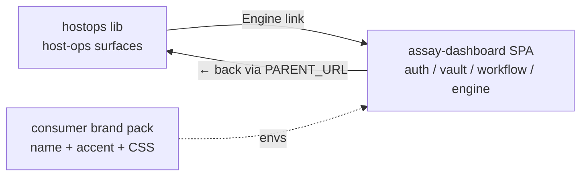

# 22 · hostops 0.1.1 — links to engine SPA

**Status:** delivered\
**Date:** 2026-05-03\
**Supersedes:** [`21`](./21-libs-folder-and-install.md) lib-boundary decision\
**Companion:**
[`knowhere/.claude/plans/02`](https://github.com/developerinlondon/knowhere/tree/main/.claude/plans/02-hostops-links-to-engine-spa.md)

## Override

Plan 21 split engine consoles (auth, vault, workflow, zanzibar, engine-core) into per-module libs
that were never built. Hostops 0.1.0 ships ~14 surfaces; predecessor monolith had ~40.

Plan 22: keep engine consoles in `crates/assay-dashboard/`. Hostops 0.1.1 adds **one sidebar link**
to the engine's existing SPA, branded per-consumer via existing `ASSAY_WHITELABEL_*` envs. No Lua
port.



## Hostops 0.1.1 changes

| File                                                                                                              | Change                                                                                                                              |
| ----------------------------------------------------------------------------------------------------------------- | ----------------------------------------------------------------------------------------------------------------------------------- |
| `libs/hostops/VERSION`                                                                                            | 0.1.0 → 0.1.1                                                                                                                       |
| `libs/hostops/mount.lua`                                                                                          | accepts `engine_base_url`, `sidebar_extras`, `plugins`, `plugin_dispatch` opts                                                      |
| `libs/hostops/ctx.lua`                                                                                            | declares those fields                                                                                                               |
| `libs/hostops/pages/render.lua`                                                                                   | switched to `template.render_with_loader` (fixes `` → was breaking machine pages); threads `engine_base_url` to layout |
| `libs/hostops/templates/layout.html`                                                                              | one `Engine` link → `engine_base_url`; brand-block flex-wrap; `{{ host.name }}` in breadcrumbs; `sidebar_extras` rendered           |
| `libs/hostops/templates/{services,logs,cron,shell,dashboard,backups/*,partials/machine_tabs,machines/index}.html` | breadcrumb host-name dynamic                                                                                                        |
| `libs/hostops/templates/shell.html`                                                                               | WS URL via `\| safe` (HTML-escape was breaking browser WS connect)                                                                  |
| `libs/hostops/templates/backups/index.html`                                                                       | vault-sealed warning's `/vault` link → `{{ engine_base_url }}/vault/console`                                                        |
| `libs/hostops/services/host/backups.lua`                                                                          | TOML fallback parser fixed for multi-line `sources = [`                                                                             |
| `libs/hostops/services/plugins.lua`                                                                               | reads `hctx.plugins` (no global)                                                                                                    |

## assay-dashboard change

`assets/{auth,vault,workflow,engine}/index.html` cross-nav title: hardcoded `Assay Engine` →
`__BRAND_NAME__`. SPA top-bar now reflects whitelabel.

## Mount API

```lua
hostops.mount(routes, {
  state, audit, jobs, secret, brand, engine,
  prefix, lib_root, backup_profile_dir,

  -- New in 0.1.1
  engine_base_url = "https://knowhere2-engine.agenteda.com",
  sidebar_extras  = { {href, label, nav_active}, ... },
  plugins         = { {id, label, sidebar_href}, ... },
  plugin_dispatch = function(req) ... end,
})
```

`require("hostops.render").wrap_layout(html, ctx, req)` is the public custom-page renderer.

## Test

`tests-lua/smoke.test.lua` continues to gate. End-to-end on `https://knowhere2.agenteda.com`

- `https://knowhere2-engine.agenteda.com`.

## Delivery

One assay PR: hostops 0.1.1 + cross-nav-title fix in `crates/assay-dashboard/`. Bump assay 0.15.7 →
0.15.8 for the SPA HTML change. Consumer apps update `Manifest.lua`.

## Open

1. Engine SPA design system match — layout/fonts/buttons. Separate plan.
2. Universal brand-pack convention — promote to assay-wide. Separate plan.
3. `assay.toml` would replace the hand-rolled fallback parser.
4. `assay.rustic` s3 backend listing — upstream stdlib limitation.
