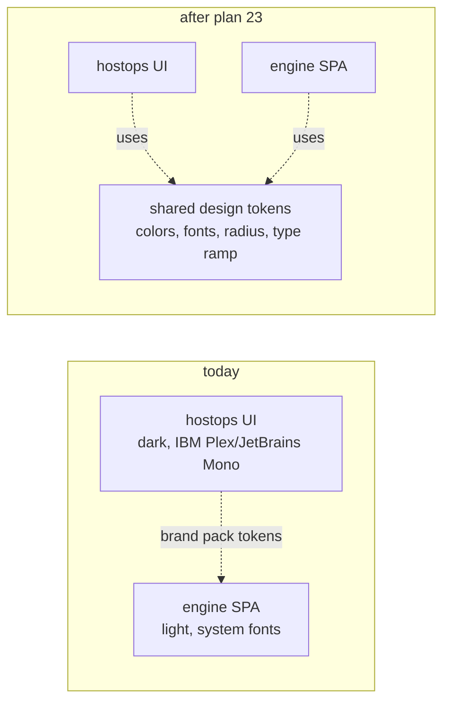

# 23 · engine SPA matches hostops design system

**Status:** spec\
**Date:** 2026-05-03

## Goal

`crates/assay-dashboard/` SPA visually continuous with hostops — same fonts, surfaces, button
styles, type ramp. Today only token-level whitelabel (NAME, MARK, accent) applies via
`ASSAY_WHITELABEL_CSS_URL`; layout/components still feel like a different product.

## Approach

Adopt hostops's tokens as the canonical assay design system. Engine SPA's `tokens.css` gets
rewritten to match hostops's. Component CSS continues to live where it does — only the variable
definitions change.

| File                                                                    | Change                                                                         |
| ----------------------------------------------------------------------- | ------------------------------------------------------------------------------ |
| `libs/hostops/static/css/tokens.css`                                    | extracted to `crates/assay-dashboard/assets/shared/tokens.css` (single source) |
| `crates/assay-dashboard/assets/{auth,vault,workflow,engine}/index.html` | `<link>` shared tokens.css before per-console style.css                        |
| `libs/hostops/templates/layout.html`                                    | `<link>` shared tokens.css instead of its own copy                             |
| `crates/assay-dashboard/assets/{auth,vault,workflow,engine}/style.css`  | re-tune button/surface rules to use the shared tokens (most already do)        |
| `crates/assay-dashboard/src/whitelabel.rs`                              | document the new shared-tokens convention                                      |

## What stays out

- Sidebar nav structure differs intentionally (engine SPA has cross-console pills, hostops has
  top-level nav). Plan 23 unifies tokens, not layout primitives.
- Component-level rewrites (form inputs, modals) remain on each side.

## Validation

- Render every engine SPA page side-by-side with the corresponding hostops page in Playwright;
  assert tokens (`getComputedStyle(el).color`, `font-family`) match for headings / body / muted /
  accent.
- Visual diff against current screenshots; brand pack overlay unchanged.

## Delivery

One assay PR. Bumps `assay-dashboard 0.3.0 → 0.4.0` (asset version), rolls into the next hostops
release.

## Open

1. Engine SPA's existing visual identity vs hostops — which side adapts? Default: engine adopts
   hostops (the host-ops dashboard is the entry point; engine is back-office).
2. Light-theme support — hostops dark-only today. Engine SPA has both. If shared tokens are adopted,
   do we extend hostops to dual-theme too?
