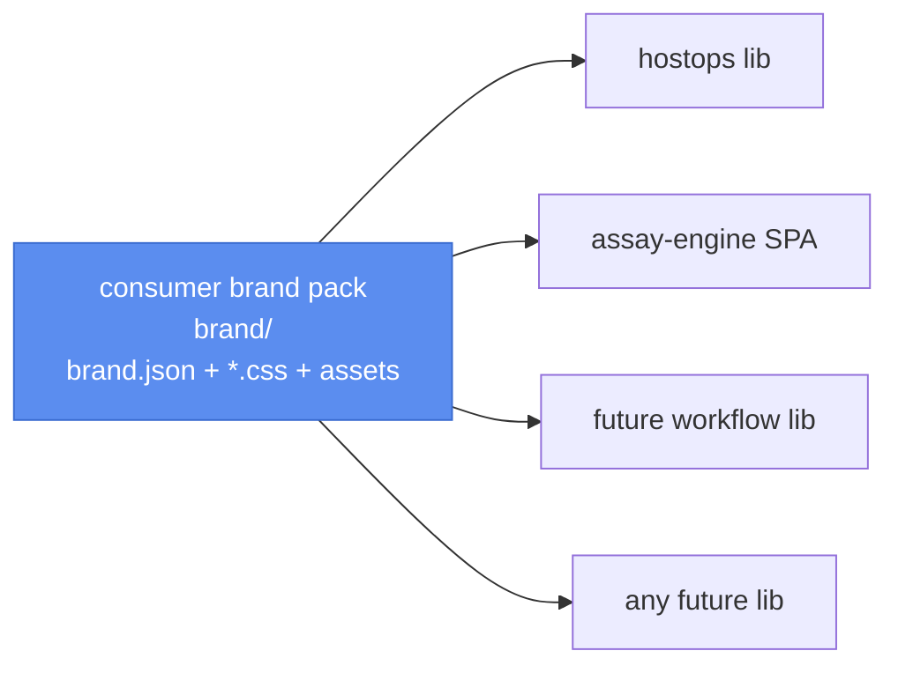

# 24 · universal brand-pack convention

**Status:** spec\
**Date:** 2026-05-03

## Goal

Brand pack is a first-class assay concept — any lib, extension, or crate can consume it the same
way. Today knowhere2's `brand/` is a private convention only hostops + the engine sidecar know
about.



## Pack shape

```
brand/
├── brand.json              tokens (name, subtitle, accent_hex, favicon_url, ...)
├── tokens.css              CSS variable overrides (consumed by every surface)
├── <surface>.css           per-surface overrides (optional: hostops.css, engine.css, ...)
├── favicon.svg             single favicon
└── logo.svg                optional brand mark
```

`brand.json` is the source of truth for tokens; CSS files apply the same tokens to specific
surfaces. Operators editing one keeps the others in sync only by hand for now (codegen deferred).

## Standard envs assay surfaces consume

| Env                          | Source field             |
| ---------------------------- | ------------------------ |
| `ASSAY_BRAND_NAME`           | `brand.json.name`        |
| `ASSAY_BRAND_SUBTITLE`       | `brand.json.subtitle`    |
| `ASSAY_BRAND_ACCENT_HEX`     | `brand.json.accent_hex`  |
| `ASSAY_BRAND_FAVICON_URL`    | url to brand/favicon.svg |
| `ASSAY_BRAND_LOGO_URL`       | url to brand/logo.svg    |
| `ASSAY_BRAND_TOKENS_CSS_URL` | url to brand/tokens.css  |
| `ASSAY_BRAND_PARENT_URL`     | consumer app root        |
| `ASSAY_BRAND_PARENT_NAME`    | == `_NAME`               |

These supersede the existing `ASSAY_WHITELABEL_*` envs. Backward-compat shim reads
`ASSAY_WHITELABEL_*` if `ASSAY_BRAND_*` isn't set.

## New crate

`crates/assay-brand/` — single dependency consumed by any lib/extension that wants brand support.
Exposes:

```rust
pub struct BrandConfig { /* fields above */ }
impl BrandConfig {
  pub fn from_env() -> Self;
  pub fn render_html_meta(&self) -> String;  // <link rel="icon">, <title>, etc.
}
```

`crates/assay-dashboard/src/whitelabel.rs` becomes a thin shim that re-exports
`assay_brand::BrandConfig` under the old name. No behavior change.

Lua side: a stdlib module `assay.brand` that serves brand pack files at `/brand/*` for consumer
apps. Hostops's `services/brand.lua` collapses into a thin wrapper.

## Consumer-app convention

```lua
-- scripts/main.lua
local brand = require("assay.brand").from_dir("./brand")
brand.serve_routes(routes)  -- registers /brand/{tokens.css,favicon.svg,...}

hostops.mount(routes, { brand = brand, ... })
```

Engine systemd unit reads `ASSAY_BRAND_*` envs from `brand/brand.json` (small generator script in
the assay-brand crate emits a systemd `EnvironmentFile=` snippet).

## Phases

1. **Spec the BrandConfig surface** (this plan + assay-brand crate scaffolding).
2. **Move whitelabel logic** from `crates/assay-dashboard/src/whitelabel.rs` into
   `crates/assay-brand/`. Dashboard re-exports.
3. **Shim `ASSAY_WHITELABEL_*` → `ASSAY_BRAND_*`** for backward-compat.
4. **Lua `assay.brand` stdlib** + `brand/brand.json` schema.
5. **Hostops + knowhere2 cutover** — services/brand.lua becomes a wrapper.

Each phase ships independently. Phase 5 lands as part of hostops 0.2.

## Open

1. Generator script: `assay brand env > brand.env` for systemd `EnvironmentFile=`. Or inline in the
   dashboard binary?
2. Multi-theme brand packs (light + dark variants of tokens.css)?
3. Fonts as part of the pack or always system / well-known?
