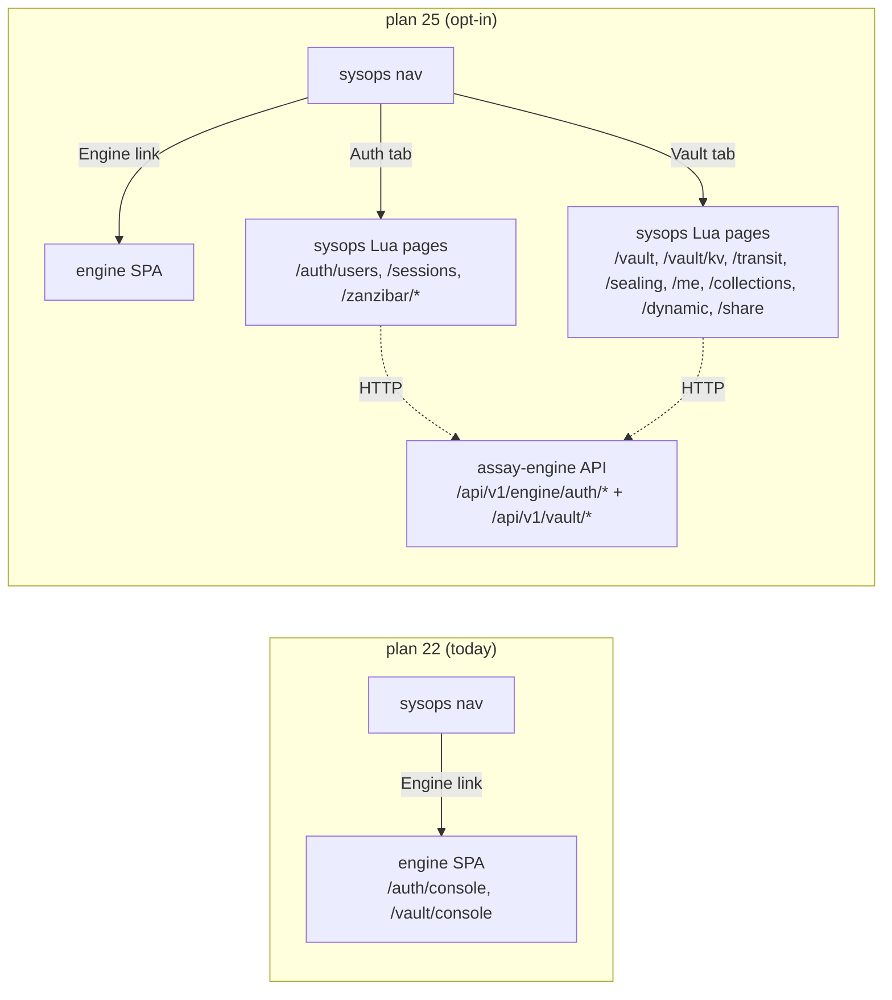

# 25 · sysops 0.1.5 — auth + vault pages in Lua

**Status:** spec **Date:** 2026-05-08 **Target tag:** `assay-lib-sysops-v0.1.5` **Branch:**
`feature/0.1.5-sysops-auth-vault` **Revisits:** [`22`](./22-engine-consoles-in-hostops.md) (opted
into "Engine link only, no Lua port") **Companion (consumer side):** knowhere repo bumps
`Manifest.lock` to `0.1.5`, opts into `active_modules = {"auth","vault"}` to surface the new pages

## Why this exists

Plan 22 (delivered, 2026-05-03) decided sysops would link to the engine's whitelabeled SPA at
`/auth/console`, `/vault/console`, etc. — no Lua mirror. That decision held while the engine SPA was
the only consumer-facing surface.

Knowhere now needs auth and vault management _inside_ sysops's own dashboard so consumer apps can
render a single end-to-end product without the engine SPA frame switch. The reference implementation
already exists in `fcar/knowhere-pkg` (the in-house Rust monolith): full Lua-rendered auth + vault
pages backed by HTTP calls to engine. Plan 25 ports that pattern upstream into `libs/sysops/` so any
consumer (knowhere, future apps) gets the same surface for free.

The Engine sidebar link from plan 22 stays — it remains the default. The new Lua pages are an
**opt-in** layer behind `active_modules`. Consumers that don't opt in see no behaviour change.



## Goal

Ship **sysops 0.1.5** containing:

1. A pure-Lua **client SDK** wrapping every public engine endpoint under `assay-vault` +
   `assay-auth` (incl. zanzibar + bitwarden-compat collections).
2. **Lua-rendered dashboard pages** for those surfaces, mirroring the layout in
   `fcar/knowhere-pkg/frontend/{auth,vault,zanzibar}/*.html`.
3. **Zero forced change** for existing 0.1.4 consumers — opt-in via `active_modules`.

Knowhere bumps to `0.1.5`, flips `active_modules = {"auth","vault"}`, gets the new tabs in its
sidebar.

## Non-goals

- Re-implementing engine logic in Lua (KV-v2 storage, OIDC token signing, transit crypto, zanzibar
  resolver) — the engine remains the source of truth.
- Replacing the engine SPA. Consumers can still link to it via the unchanged `Engine` sidebar entry.
- Login / passkey enrollment flows in sysops. Login still lives at engine's `/login`; sysops pages
  assume an authenticated admin context (admin bearer token or session cookie).
- Mobile-bitwarden-client–facing endpoints. The compat protocol stays on the engine. Sysops only
  consumes `bitwarden-compat` to surface the cipher / folder lists in `/vault/me` +
  `/vault/collections`.
- Per-plugin namespace scoping (the Rust binding in knowhere-pkg has it; not needed for sysops).

## Reference implementation

Pages and templates are ports of:

```
fcar/knowhere-pkg/backend/{auth,vault,zanzibar}/*.lua
fcar/knowhere-pkg/frontend/{auth,vault,zanzibar}/*.html
```

The port keeps the same URL shape, page titles, tabs, page-header eyebrow, banner / pill /
filter-bar / card-head / table conventions. Static assets (`styles.css`, `app.js`, `tokens.css`)
already render this look in sysops 0.1.4 — no styling changes required.

## File changes

### New library files

```
libs/sysops/
├── auth.lua                           # SDK aggregator
├── auth/
│   ├── session.lua                    # GET  /whoami,  POST /login,  DELETE /session
│   │                                  # POST /passkey/register/{start,finish}
│   │                                  # POST /passkey/auth/{start,finish}
│   ├── users.lua                      # GET/POST /admin/users, GET /admin/users/{id}, …/edit
│   ├── sessions.lua                   # GET /admin/sessions, DELETE /admin/sessions/{id}
│   ├── oidc.lua                       # GET /admin/oidc-clients, /admin/upstreams, /admin/jwks
│   ├── biscuit.lua                    # GET /admin/biscuit
│   ├── audit.lua                      # GET /admin/audit
│   └── zanzibar.lua                   # POST /admin/zanzibar/{check,expand,tuples},
│                                      # DELETE /admin/zanzibar/tuples
├── vault.lua                          # SDK aggregator (keeps existing secret_store)
├── vault/
│   ├── kv.lua                         # GET/PUT  /api/v1/vault/kv/{*path},
│   │                                  # GET /kv-list, /kv-meta, POST /kv-destroy, /kv-undelete
│   ├── transit.lua                    # POST /transit/keys/{name}, /rotate, /encrypt/{name},
│   │                                  # /decrypt/{name}, GET /transit/keys
│   ├── sealing.lua                    # GET /sys/seal-status, POST /sys/{seal,unseal,init}
│   ├── dynamic.lua                    # POST /dynamic/{provider}/{role}/lease,
│   │                                  # GET /dynamic/leases, DELETE /dynamic/leases/{id}
│   ├── share.lua                      # POST /share, GET /share/{token}, POST /share/revoke
│   ├── collections.lua                # POST /folders + bitwarden-compat collections
│   └── me.lua                         # bitwarden-compat personal vault (ciphers, sync, profile)
├── pages/
│   ├── auth/
│   │   ├── users.lua                  # /auth/users          (default Auth landing)
│   │   ├── user_edit.lua              # /auth/users/{id}/edit
│   │   ├── sessions.lua               # /auth/sessions
│   │   ├── oidc_clients.lua           # /auth/oidc-clients
│   │   ├── upstreams.lua              # /auth/upstreams
│   │   ├── jwks.lua                   # /auth/jwks
│   │   ├── biscuit.lua                # /auth/biscuit
│   │   └── audit.lua                  # /auth/audit
│   ├── zanzibar/
│   │   ├── index.lua                  # /zanzibar  (namespaces, default)
│   │   ├── tuples.lua                 # /zanzibar/tuples
│   │   └── check.lua                  # /zanzibar/check
│   └── vault/
│       ├── index.lua                  # /vault     (overview + seal pill)
│       ├── kv.lua                     # /vault/kv  (?prefix=…)
│       ├── transit.lua                # /vault/transit
│       ├── sealing.lua                # /vault/sealing
│       ├── dynamic.lua                # /vault/dynamic
│       ├── share.lua                  # /vault/share
│       ├── collections.lua            # /vault/collections
│       └── me.lua                     # /vault/me
├── templates/
│   ├── auth/
│   │   ├── users.html
│   │   ├── user_edit.html
│   │   ├── sessions.html
│   │   ├── oidc_clients.html
│   │   ├── upstreams.html
│   │   ├── jwks.html
│   │   ├── biscuit.html
│   │   └── audit.html
│   ├── zanzibar/
│   │   ├── index.html
│   │   ├── tuples.html
│   │   └── check.html
│   └── vault/
│       ├── index.html
│       ├── kv.html
│       ├── transit.html
│       ├── transit_op_result.html
│       ├── sealing.html
│       ├── sealing_init_result.html
│       ├── dynamic.html
│       ├── share.html
│       ├── collections.html
│       └── me.html
└── tests-lua/
    ├── auth/{session,users,sessions,oidc,biscuit,audit,zanzibar}.test.lua
    └── vault/{kv,transit,sealing,dynamic,share,collections,me}.test.lua
```

### Edits to existing files

| File                                | Change                                                                                                                                                                                                                                             |
| ----------------------------------- | -------------------------------------------------------------------------------------------------------------------------------------------------------------------------------------------------------------------------------------------------- |
| `libs/sysops/VERSION`               | `0.1.4` → `0.1.5`                                                                                                                                                                                                                                  |
| `libs/sysops/Manifest.lua`          | register new lua/html files (so packager picks them up)                                                                                                                                                                                            |
| `libs/sysops/mount.lua`             | (a) accept `opts.active_modules` (table of strings), stash on `ctx.active_modules`. (b) register new GET/POST routes — gated on `active_modules` membership so unopted consumers see zero new routes.                                              |
| `libs/sysops/pages.lua`             | extend slug → handler map with the new page handlers.                                                                                                                                                                                              |
| `libs/sysops/ctx.lua`               | add `active_modules` field (default `{}`); add `engine_admin_key` passthrough used by the SDK to authenticate admin calls.                                                                                                                         |
| `libs/sysops/templates/layout.html` | **only** add two conditional `<nav>` blocks for Auth + Vault, gated on `active_modules` containing `"auth"` / `"vault"`. All existing entries (Host, Networks, Engine, Admin, extra_sidebar_links, brand block, theme toggle, nav-meta) untouched. |
| `libs/sysops/README.md`             | document `active_modules`, the new SDK surface, and the new page routes.                                                                                                                                                                           |

### `mount.lua` — exact route registration shape

Each new route is gated:

```lua
if has_module(opts.active_modules, "auth") then
  routes.GET[ctx.url("/auth/users")]                     = pages.auth_users
  routes.POST[ctx.url("/auth/users")]                    = pages.auth_users_create
  routes.GET[ctx.url("/auth/users/*/edit")]              = pages.auth_user_edit
  routes.POST[ctx.url("/auth/users/*/edit")]             = pages.auth_user_save
  routes.POST[ctx.url("/auth/users/*/delete")]           = pages.auth_user_delete
  routes.GET[ctx.url("/auth/sessions")]                  = pages.auth_sessions
  routes.POST[ctx.url("/auth/sessions/*/revoke")]        = pages.auth_session_revoke
  routes.GET[ctx.url("/auth/oidc-clients")]              = pages.auth_oidc_clients
  routes.GET[ctx.url("/auth/upstreams")]                 = pages.auth_upstreams
  routes.GET[ctx.url("/auth/jwks")]                      = pages.auth_jwks
  routes.GET[ctx.url("/auth/biscuit")]                   = pages.auth_biscuit
  routes.GET[ctx.url("/auth/audit")]                     = pages.auth_audit
  routes.GET[ctx.url("/zanzibar")]                       = pages.zanzibar_index
  routes.GET[ctx.url("/zanzibar/tuples")]                = pages.zanzibar_tuples
  routes.POST[ctx.url("/zanzibar/tuples")]               = pages.zanzibar_tuples_write
  routes.POST[ctx.url("/zanzibar/tuples/delete")]        = pages.zanzibar_tuples_delete
  routes.GET[ctx.url("/zanzibar/check")]                 = pages.zanzibar_check
  routes.POST[ctx.url("/zanzibar/check")]                = pages.zanzibar_check_run
end

if has_module(opts.active_modules, "vault") then
  routes.GET[ctx.url("/vault")]                          = pages.vault_index
  routes.GET[ctx.url("/vault/kv")]                       = pages.vault_kv
  routes.POST[ctx.url("/vault/kv/put")]                  = pages.vault_kv_put
  routes.POST[ctx.url("/vault/kv/delete")]               = pages.vault_kv_delete
  routes.GET[ctx.url("/vault/transit")]                  = pages.vault_transit
  routes.POST[ctx.url("/vault/transit/create")]          = pages.vault_transit_create
  routes.POST[ctx.url("/vault/transit/rotate")]          = pages.vault_transit_rotate
  routes.POST[ctx.url("/vault/transit/encrypt")]         = pages.vault_transit_encrypt
  routes.POST[ctx.url("/vault/transit/decrypt")]         = pages.vault_transit_decrypt
  routes.GET[ctx.url("/vault/sealing")]                  = pages.vault_sealing
  routes.POST[ctx.url("/vault/seal")]                    = pages.vault_seal
  routes.POST[ctx.url("/vault/unseal")]                  = pages.vault_unseal
  routes.POST[ctx.url("/vault/init")]                    = pages.vault_init
  routes.GET[ctx.url("/vault/dynamic")]                  = pages.vault_dynamic
  routes.POST[ctx.url("/vault/dynamic/lease")]           = pages.vault_dynamic_lease
  routes.POST[ctx.url("/vault/dynamic/leases/*/revoke")] = pages.vault_dynamic_revoke
  routes.GET[ctx.url("/vault/share")]                    = pages.vault_share
  routes.POST[ctx.url("/vault/share")]                   = pages.vault_share_mint
  routes.POST[ctx.url("/vault/share/revoke")]            = pages.vault_share_revoke
  routes.GET[ctx.url("/vault/me")]                       = pages.vault_me
  routes.GET[ctx.url("/vault/collections")]              = pages.vault_collections
  routes.POST[ctx.url("/vault/collections")]             = pages.vault_collections_create
end
```

`has_module(active_modules, name)` is a tiny table-membership helper added to `mount.lua` private
scope — same shape as the `active_modules | default([])` Jinja test in the layout.

### `layout.html` — exact diff

```diff
   <nav class="nav nav-flat">
     <a href="/audit" class="active">Admin</a>
   </nav>

+  {# Optional Auth + Vault sections. Hidden unless consumer opts in via
+     opts.active_modules = { "auth", "vault", … }. Existing host-ops
+     sidebar entries above are unchanged. #}
+  
+  <nav class="nav nav-flat">
+    <a href="/auth/users" class="active">Auth</a>
+  </nav>
+  
+
+  
+  <nav class="nav nav-flat">
+    <a href="/vault" class="active">Vault</a>
+  </nav>
+  
+
   {# Consumer-app links (mount opts.extra_sidebar_links). … #}
```

## SDK API surface (Lua)

Every SDK module is constructed with the existing engine HTTP client (already injected via
`opts.engine` at mount time):

```lua
local sdk = require("sysops.vault").new(ctx.engine)
local val, err = sdk.kv.get("apps/foo/db_url")
sdk.kv.put("apps/foo/db_url", "postgres://…")
sdk.transit.encrypt("master", "hello world")
sdk.dynamic.lease("postgres", "readonly")
sdk.sealing.status()

local auth = require("sysops.auth").new(ctx.engine)
auth.session.whoami()
auth.users.list({ search = "alice" })
auth.zanzibar.check("user:alice", "viewer", "doc:foo")
auth.zanzibar.write("user:alice", "viewer", "doc:foo")
```

| Module              | Methods                                                           | Engine endpoint                                                 |
| ------------------- | ----------------------------------------------------------------- | --------------------------------------------------------------- |
| `vault.kv`          | get / put / delete / list / meta / destroy / undelete             | `/api/v1/vault/kv/*`                                            |
| `vault.transit`     | keys / create / rotate / encrypt / decrypt                        | `/api/v1/vault/transit/*`                                       |
| `vault.sealing`     | status / seal / unseal / init                                     | `/api/v1/vault/sys/*`                                           |
| `vault.dynamic`     | lease / list / revoke                                             | `/api/v1/vault/dynamic/*`                                       |
| `vault.share`       | mint / redeem / revoke                                            | `/api/v1/vault/share/*`                                         |
| `vault.collections` | list / create / share / members                                   | `/api/v1/vault/folders` + collections                           |
| `vault.me`          | sync / ciphers / folders / profile                                | bitwarden-compat `/api/{ciphers,folders,sync,accounts/profile}` |
| `auth.session`      | login / logout / whoami / passkey.*                               | `/api/v1/engine/auth/{login,session,whoami,passkey/*}`          |
| `auth.users`        | list / get / create / update / delete                             | `/api/v1/engine/auth/admin/users[/{id}]`                        |
| `auth.sessions`     | list / revoke                                                     | `/api/v1/engine/auth/admin/sessions[/{id}]`                     |
| `auth.oidc`         | clients / upstreams / jwks                                        | `/api/v1/engine/auth/admin/{oidc-clients,upstreams,jwks}`       |
| `auth.biscuit`      | info                                                              | `/api/v1/engine/auth/admin/biscuit`                             |
| `auth.audit`        | list                                                              | `/api/v1/engine/auth/admin/audit`                               |
| `auth.zanzibar`     | namespaces / tuples / write_tuple / delete_tuple / check / expand | `/api/v1/engine/auth/admin/zanzibar/*`                          |

All modules return either `(data, nil)` on success or `(nil, err_table)` on failure, where
`err_table = { status = N, body = … }`. Pages render the error banners shown in the wireframes based
on this shape.

## Page contract

Each page handler:

```lua
function(req) -> {
  status  = 200,
  headers = { ["Content-Type"] = "text/html; charset=utf-8" },
  body    = render("auth/users.html", {
    nav_active = "auth:users",
    page_title = "Users",
    users      = users,
    total      = total,
    search     = req.query.search,
    -- … plus standard layout vars (brand, host, version, actor, active_modules)
  }),
}
```

Conventions (lifted from knowhere-pkg):

- `nav_active` is `<section>:<sub>` — sidebar matches on `<section>:` prefix; tab strips match on
  exact value.
- Page header: eyebrow link to section root + page title + meta pills (counts, status).
- Banner error states for `status == 0` (engine unreachable / admin auth missing) and
  `status == 503` (module disabled at engine compile time).
- All forms POST same-origin; no JS fetch / SPA. htmx is loaded by layout but not required.

## Tests

One unit test file per SDK + page module:

- SDK tests stub `engine` (table with `get/post/put/delete` + `api_call`), assert request method /
  path / body shape, simulate 200 / 404 / 503 responses.
- Page tests render the template against a stub SDK, assert the rendered HTML contains the expected
  page title, tab, and table rows.

CI: extend `assay/.github/workflows/*.yml` Lua test job to include the new tests-lua paths. Existing
sysops 0.1.4 tests continue to pass — opt-in via `active_modules` means no behavioural change for
unopted suites.

## Sequencing (5 phases on the branch, one PR per phase or one bundled PR)

1. **Phase 1 — SDK** (`libs/sysops/auth/*.lua`, `vault/*.lua`): pure Lua HTTP wrappers. Unit tests
   per module with stubbed engine. **No UI yet**, no route changes.
2. **Phase 2 — Layout + ctx** (`templates/layout.html` two-block diff, `ctx.lua` field, `mount.lua`
   `active_modules` plumbing). Existing pages keep working; new sidebar links appear only when opted
   in.
3. **Phase 3 — Auth + Zanzibar pages** (`pages/auth/*`, `pages/zanzibar/*`, templates). Wired into
   `mount.lua` route registration block.
4. **Phase 4 — Vault pages** (`pages/vault/*`, templates). Wired into `mount.lua`.
5. **Phase 5 — VERSION + README + Manifest.lua** bump to 0.1.5; update README with `active_modules`
   docs and the new page list. Tag `assay-lib-sysops-v0.1.5`.

A companion knowhere PR bumps `Manifest.lock` to `0.1.5`, sets `active_modules = {"auth","vault"}`,
and updates the `0.1.4` assertion in `.github/workflows/ci.yml:57` to `0.1.5`. Land sysops 0.1.5
first; knowhere bump second.

## Risks / open items

- **Admin auth context.** All admin endpoints require an admin bearer token. SDK reads it from
  `ctx.engine_admin_key` (passed via `mount` opts) — same shape `vault.lua:secret_store` already
  uses. If unset, pages render the "admin auth missing" banner instead of leaking 401s.
- **Bitwarden personal vault size.** A user's `/api/sync` payload can be large. SDK should support
  pagination / cursors when engine adds them; for 0.1.5 we issue one-shot calls and accept that
  large vaults are slow. Document in the `vault.me` README.
- **Zanzibar tuple list endpoint.** Engine doesn't yet expose `GET /admin/zanzibar/tuples` (see
  `knowhere-pkg/frontend/zanzibar/tuples.html:74-88`). Sysops port mirrors that limitation: the page
  renders the write/delete forms plus the "listing not shipped" banner.
- **Plan 22 reversal.** Plan 22 explicitly chose "no Lua port." Plan 25 doesn't _replace_ it —
  `Engine` link stays, new pages are opt-in. If a consumer doesn't pass `active_modules`, plan 22's
  behaviour is unchanged. Still worth flagging in the v0.1.5 release notes.
- **Test coverage.** ~12 SDK files + ~20 page handlers = ~30 new test files. Coverage target: every
  SDK method exercised + happy / 503 / 404 / 0 banner branches per page.

## Out of scope (lands in later plans if needed)

- KV folder / tree UI (current port lists by prefix string, like knowhere-pkg).
- Zanzibar tuple listing UI (waits on engine `GET /admin/zanzibar/tuples`).
- OIDC client _editing_ (read-only list in 0.1.5; create / edit forms in 0.1.6).
- Per-user passkey management UI (sysops 0.1.5 only shows the `has_passkey` flag).
- Workflows tab — separate plan, separate `active_modules = {"workflow"}` opt-in.
