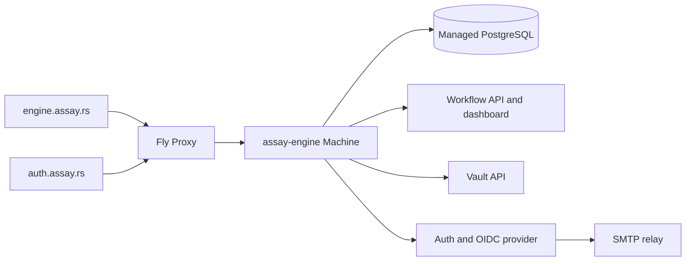

# Assay flagship service

This directory deploys the complete released `assay-engine` binary as Assay's public first-party
service. It deliberately remains one process and one PostgreSQL backend:



`engine.assay.rs` is the canonical authenticated engine, workflow, and vault API URL.
`auth.assay.rs` is the canonical browser auth, passkey, and OIDC issuer origin. Its root serves only
a public sign-in landing; the first-party deployment does not mount workflow, engine, vault, or auth
operator consoles. Both names route to the same Machine, and the process accepts ordinary requests
only for those two hostnames. Fly health checks remain public at the exact core-health path.

## Runtime contract

- Fly app: `assay-auth` in the `personal` organisation, primary region `lhr`.
- Image: exact released `ghcr.io/developerinlondon/assay-engine:<version>` tag.
- Database: external PostgreSQL via the `DATABASE_URL` Fly secret; no Fly volume or local state.
- Operator credential: `ADMIN_API_KEY` Fly secret; never committed or passed as a command argument.
- Public boundary: only `auth.assay.rs` and `engine.assay.rs` Host values are accepted; the Fly
  hostname can answer the exact health probe but returns `421` for ordinary requests.
- Password recovery: `SMTP_HOST`, `SMTP_USERNAME`, and `SMTP_PASSWORD` Fly secrets connect the auth
  surface to the configured STARTTLS relay. The public response does not wait for delivery and does
  not reveal whether an address exists.
- Vault sealing: none. `engine.toml` sets `[vault.sealing] allow_plaintext_kek = true`, so the
  vault's master key stays in `vault.kek_metadata` in the clear and every boot logs that at ERROR.
  No seal secret is part of the runtime contract. Turning sealing on is the procedure below, not a
  deploy.
- Capacity: one shared CPU and 512 MB RAM. The Machine stops while idle and starts on the next
  request; PostgreSQL remains available independently.
- Readiness: `GET /api/v1/engine/core/health` must return 2xx before Fly routes traffic.

## Sealing the vault master key

The vault encrypts every secret it holds under one master key, and that key is a row in this
deployment's own database. Unsealed, a dump of that database is a copy of every secret in the vault.
Sealing encrypts the key at rest so the dump carries only ciphertext.

This is not a config change to roll out and roll back. The first boot with unseal material rewrites
that row **one-way**: afterwards the key exists only under the material supplied, and losing that
material loses every secret the vault wraps, with no plaintext copy left. The engine refuses to do
it until told to, and the order below matters.

1. **Back up `vault.kek_metadata`** from the managed PostgreSQL. This is the step the whole
   procedure exists to protect; the table being small is not a reason to skip it.
2. **Mint and store the material.** `openssl rand -base64 32`, then
   `fly secrets set ASSAY_VAULT_SEAL_KEY=… --app assay-auth`. That is the variable the engine
   reads by default, so nothing names it in the config and the key never enters the config struct.
   Keep a copy somewhere the database backups are not — whoever holds both the dump and the key
   has neither. It is not recoverable.
3. **Permit the rewrite** in `engine.toml`, replacing the `allow_plaintext_kek` line:

   ```toml
   [vault.sealing]
   allow_plaintext_migration = true
   ```

4. **Deploy once.** That boot re-seals the row and logs that backups taken before now still hold the
   unsealed key. Confirm the method changed:

   ```sh
   curl -sH "Authorization: Bearer $ADMIN_API_KEY" \
     https://engine.assay.rs/api/v1/vault/sys/seal-status | jq .method
   # "env-aes-gcm"
   ```

5. **Drop `allow_plaintext_migration` and deploy again.** A sealed store never reaches that code
   path, so leaving it set changes nothing today; removing it means a later accidental downgrade is
   refused rather than silently re-sealed.

Backups taken before step 4 still hold the unsealed key. Rotate the vault's contents or destroy
those dumps if that matters. From then on `ASSAY_VAULT_SEAL_KEY` is a runtime secret: unset it
and the engine refuses to boot, because it cannot tell "the operator turned it off" from "the key
went missing". [`docs/vault-sealing.md`](../docs/vault-sealing.md) covers the other sources and the
failure modes.

## Deploy

The `Deploy flagship engine` workflow runs after the repository's `Release` workflow succeeds. It
deploys the version declared by `crates/assay-engine/Cargo.toml`, then verifies engine health and
OIDC discovery through the canonical domains. The repository secret `FLY_API_TOKEN` must be
authorized to deploy the app; prefer an app-scoped token when the Fly account can mint one.
Runtime secrets stay in Fly and are not copied into GitHub Actions.

For a manual recovery deploy, dispatch that workflow from the default branch. Do not deploy an
unreleased `latest` image: keeping the Fly release tied to the immutable engine version makes
rollback and runtime verification deterministic.
