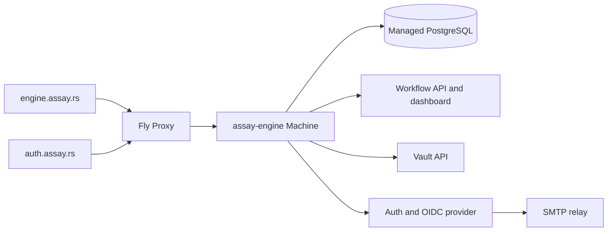

# Assay flagship service

This directory deploys the complete released `assay-engine` binary as Assay's public first-party
service. It deliberately remains one process and one PostgreSQL backend:

`engine.assay.rs` is the canonical authenticated engine, workflow, and vault API URL.
`auth.assay.rs` is the canonical browser auth, passkey, and OIDC issuer origin. Its root serves only
a public sign-in landing; the first-party deployment does not mount workflow, engine, vault, or auth
operator consoles. Both names route to the same Machine, and the process accepts ordinary requests
only for those two hostnames. Fly health checks remain public at the exact core-health path.

## Runtime contract

- Fly app: `assay-auth` in the `personal` organisation, primary region `lhr`.
- Image: exact released `ghcr.io/developerinlondon/assay-engine:<version>` tag.
- Database: external PostgreSQL via the `DATABASE_URL` Fly secret; no Fly volume or local state.
- Operator credential: `ADMIN_API_KEY` Fly secret; never committed or passed as a command argument.
- Public boundary: only `auth.assay.rs` and `engine.assay.rs` Host values are accepted; the Fly
  hostname can answer the exact health probe but returns `421` for ordinary requests.
- Password recovery: `SMTP_HOST`, `SMTP_USERNAME`, and `SMTP_PASSWORD` Fly secrets connect the auth
  surface to the configured STARTTLS relay. The public response does not wait for delivery and does
  not reveal whether an address exists.
- Capacity: one shared CPU and 512 MB RAM. The Machine stops while idle and starts on the next
  request; PostgreSQL remains available independently.
- Readiness: `GET /api/v1/engine/core/health` must return 2xx before Fly routes traffic.

## Deploy

The `Deploy flagship engine` workflow runs after the repository's `Release` workflow succeeds. It
deploys the version declared by `crates/assay-engine/Cargo.toml`, then verifies engine health and
OIDC discovery through the canonical domains. The repository secret `FLY_API_TOKEN` must be
authorized to deploy the app; prefer an app-scoped token when the Fly account can mint one.
Runtime secrets stay in Fly and are not copied into GitHub Actions.

For a manual recovery deploy, dispatch that workflow from the default branch. Do not deploy an
unreleased `latest` image: keeping the Fly release tied to the immutable engine version makes
rollback and runtime verification deterministic.
